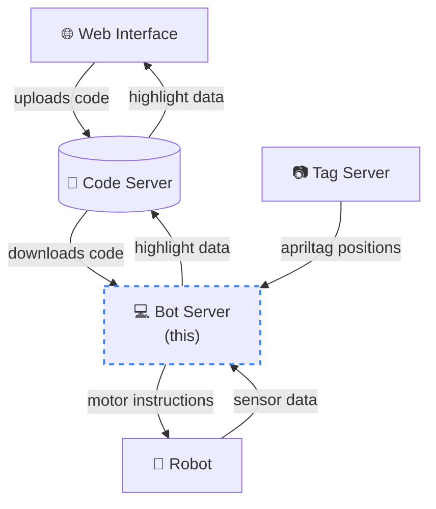

# AutoSumo Server

Core service that connects to other services and runs the robot code.

https://user-images.githubusercontent.com/26680599/185769401-c024f6a5-496c-4001-9858-a5e7ccef9a41.mp4

Upon starting, it will:
 - Connect to the [code server](https://github.com/AutoSumo/code-server) and download the specified script ID
 - Starts a WebSocket server for [the bot](https://github.com/AutoSumo/robot) to connect to
 - Connects to the WebSocket server hosted by the [arena service](https://github.com/AutoSumo/tag-server)
 - Connects to the [code server](https://github.com/AutoSumo/code-server) highlight websocket to send information about block highlighting
 - Runs the code until any of the following happens:
   - The code finishes
   - The bot leaves the arena
   - Any key is pressed

### Usage
Run `node single-bot.js <script ID>` where `<script ID>` is the ID provided by the [web frontend](https://github.com/AutoSumo/web).
