# AutoSumo Server

Core service that connects to other services and runs the robot code.

```mermaid
flowchart TD
    web["🌐 Web Interface"] -->|Uploads code| code-server[("💾 Code Server")]
    code-server -->|Downloads code| bot-server["💻 Bot Server\n(this)"]
    bot-server <-->|Bot server sends motor instructions\nand receives sensor data| robot["🤖 Robot"]
    bot-server <-->|Tag server sends positions of all tags in arena| tag-server["📷 Tag Server"]
    
    style bot-server stroke-width:2px,stroke-dasharray: 5 5,stroke:#3b82f6
    
    click web "https://github.com/AutoSumo/web"
    click code-server "https://github.com/AutoSumo/code-server"
    click robot "https://github.com/AutoSumo/robot"
    click tag-server "https://github.com/AutoSumo/tag-server"
```

Upon starting, it will:
 - Connect to the [code server](https://github.com/AutoSumo/code-server) and download the specified script ID
 - Starts a WebSocket server for [the bot](https://github.com/AutoSumo/robot) to connect to
 - Connects to the WebSocket server hosted by the [arena service](https://github.com/AutoSumo/tag-server)
 - Runs the code until any of the following happens:
   - The code finishes
   - The bot leaves the arena
   - Any key is pressed

### Usage
Run `node single-bot.js <script ID>` where `<script ID>` is the ID provided by the [web frontend](https://github.com/AutoSumo/web).
